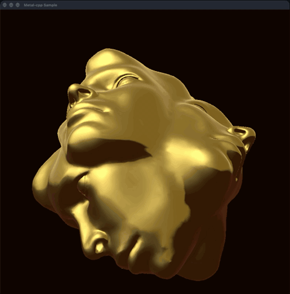
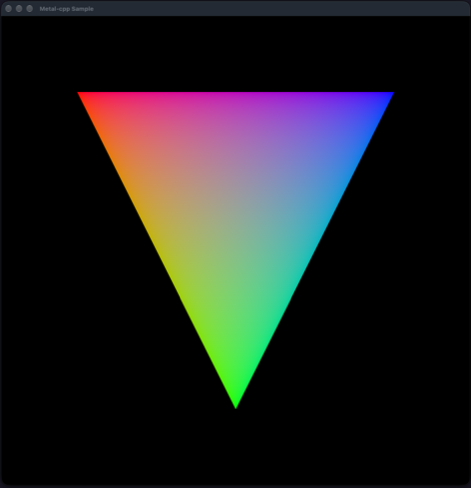

# metal-cpp-sample

A learning project in C++20 and Apple's Metal (via metal-cpp): a small renderer
that loads a glTF model and shades it with a perspective camera, depth testing
and PBR inspired lighting. It was built to learn the metal-cpp API, modern C++
and the structure of a real-time renderer by applying them together, growing
from a single triangle one deliberate design decision at a time. The scope is
intentionally small, one model and no textures, so every part can be understood
and explained. The commit history follows and documents that progression.

| glTF scene (`--scene=gltf`) | Minimal scene (`--scene=minimal`) |
|:---:|:---:|
|  |  |

## Features

- glTF 2.0 loading with fastgltf (mesh, normals, material factors)
- Perspective camera framed from the model's bounding sphere
- Depth buffer, Lambert diffuse, Blinn-Phong specular
- PBR inspired material response: metal/dielectric split, Fresnel-Schlick
  reflectance and a procedural environment reflection (no textures)
- Frame-delta animation

## Build and run

Requires macOS and Xcode (with the Metal toolchain) and CMake 3.26+. Built and
tested with Xcode 27.0 on macOS 27.0 (Apple silicon), using CMake 4.4.3 and
Ninja.

```bash
git clone --recursive \
  https://github.com/blakesimpson-dev/metal-cpp-sample.git
cd metal-cpp-sample
cmake -S . -B build -G Ninja
cmake --build build
./build/metal-cpp-sample [--scene=gltf|minimal]
```

## Layout

| Path            | Purpose                                                  |
|-----------------|----------------------------------------------------------|
| `src/app`       | Application and view delegates                           |
| `src/renderer`  | Metal renderer, camera, math and Metal helpers           |
| `src/scenes`    | `Scene` interface, glTF loader, glTF and minimal scenes  |
| `src/shaders`   | Metal shaders and C++/shader shared types                |
| `src/platform`  | Executable path lookup                                   |
| `assets`        | glTF model (Exalted Orb, see Credits)                    |
| `docs`          | README images                                            |
| `external`      | Dependencies (see below)                                 |

## Dependencies

| Dependency           | Version                          | Licence    |
|----------------------|----------------------------------|------------|
| metal-cpp            | macOS27_iOS27 release            | Apache-2.0 |
| metal-cpp-extensions | from Apple's LearnMetalCPP       | Apache-2.0 |
| fastgltf             | v0.9.0                           | MIT        |
| simdjson             | v3.12.3                          | Apache-2.0 |

## Credits

This work is based on
["Exalted Orb"](https://sketchfab.com/3d-models/exalted-orb-8729a148401b4cda8143f61c4c56c3a9)
by [justingulenchyn](https://sketchfab.com/justingulenchyn), licensed under
[CC-BY-4.0](http://creativecommons.org/licenses/by/4.0/).

The application code is my own (MIT, see [LICENSE](LICENSE)); an LLM was used
for explanations, code review and tooling configuration.

## References

- [Apple: metal-cpp](https://developer.apple.com/metal/cpp/) and the
  ["Learn Metal with C++" samples](https://developer.apple.com/metal/LearnMetalCPP.zip)
- [fastgltf](https://github.com/spnda/fastgltf) documentation and headers
- [glTF 2.0 specification](https://registry.khronos.org/glTF/specs/2.0/glTF-2.0.html) (Khronos)
- LearnOpenGL:
  [Camera](https://learnopengl.com/Getting-started/Camera),
  [Basic Lighting](https://learnopengl.com/Lighting/Basic-Lighting),
  [Advanced Lighting](https://learnopengl.com/Advanced-Lighting/Advanced-Lighting)
- [Google C++ Style Guide](https://google.github.io/styleguide/cppguide.html)
- [learncpp.com](https://www.learncpp.com/)
