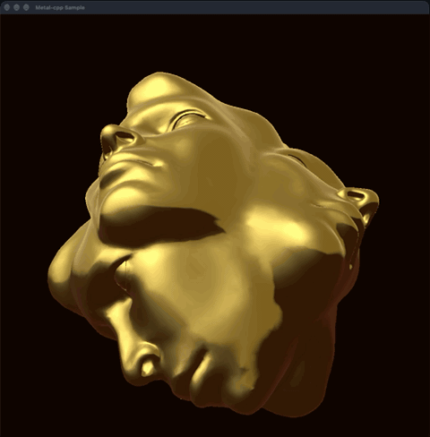
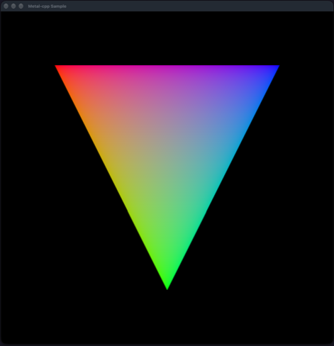

# metal-cpp-sample


[](LICENSE)

Render pipeline sample in C++20, using Apple's Metal API. The program loads a
glTF model and renders it with a perspective camera, depth testing, PBR-inspired
lighting and procedural bump mapping.

|     glTF scene (`--scene=gltf`)     |   Minimal scene (`--scene=minimal`)   |
| :---------------------------------: | :-----------------------------------: |
|  |  |

## Features

- **glTF:** 2.0 via fastgltf (mesh, normals, material factors)
- **Camera:** perspective, framed from the model's bounding sphere
- **Frames in flight:** triple-buffered uniforms, semaphore paced
- **Lighting:** Lambert diffuse, Blinn-Phong specular, Fresnel and procedural
  environment reflection
- **Bump mapping:** procedural noise, surface gradient method, no UVs
- **Rendering:** depth buffer, 4x MSAA (switchable with `--msaa`)
- **Animation:** frame-delta turntable rotation with bounded tilt

## Build and run

Requires Apple Clang (GCC / MSVC are not supported), Xcode w/ Metal toolchain,
and CMake 3.26+. Tested on macOS 27.0, CMake 4.4.3 and Ninja.

```bash
git clone --recursive https://github.com/blakesimpson-dev/metal-cpp-sample.git
cd metal-cpp-sample
cmake -S . -B build -G Ninja
cmake --build build
./build/metal-cpp-sample [--scene=gltf|minimal] [--msaa=on|off]
```

### Download

Alternatively, you may [download the sample](LINK). Run the following on your
machine after unzipping (Gatekeeper can be problematic):

```bash
xattr -dr com.apple.quarantine metal-cpp-sample-v1.0.0-macos-arm64
```

## Layout

| Path           | Contents                                                |
| -------------- | ------------------------------------------------------- |
| `src/app`      | Application and view delegates                          |
| `src/renderer` | Metal renderer, camera, math and Metal helpers          |
| `src/scenes`   | `Scene` interface, glTF loader, glTF and minimal scenes |
| `src/shaders`  | Metal shaders, types shared with C++                    |
| `src/platform` | Executable path, metal-cpp ownership helpers            |
| `assets`       | glTF model (see [Credits](#credits))                    |
| `docs`         | README images                                           |
| `external`     | Dependencies                                            |

## Dependencies

| Dependency           | Version                    | Licence    |
| -------------------- | -------------------------- | ---------- |
| metal-cpp            | macOS27_iOS27 release      | Apache-2.0 |
| metal-cpp-extensions | from Apple's LearnMetalCPP | Apache-2.0 |
| fastgltf             | v0.9.0                     | MIT        |
| simdjson             | v3.12.3                    | Apache-2.0 |

## Credits

Model:
["Exalted Orb"](https://sketchfab.com/3d-models/exalted-orb-8729a148401b4cda8143f61c4c56c3a9)
by [justingulenchyn](https://sketchfab.com/justingulenchyn)
([CC-BY-4.0](http://creativecommons.org/licenses/by/4.0/)). The application code
is my own (MIT, see [LICENSE](LICENSE)); an LLM was used for explanations, code
review and tooling configuration.

## References

- Apple: [metal-cpp](https://developer.apple.com/metal/cpp/),
  ["Learn Metal with C++" samples](https://developer.apple.com/metal/LearnMetalCPP.zip),
  Metal Best Practices
  ([Triple Buffering](https://developer.apple.com/library/archive/documentation/3DDrawing/Conceptual/MTLBestPracticesGuide/TripleBuffering.html),
  [Buffer Bindings](https://developer.apple.com/library/archive/documentation/3DDrawing/Conceptual/MTLBestPracticesGuide/BufferBindings.html))
- glTF: [fastgltf](https://github.com/spnda/fastgltf),
  [glTF 2.0 specification](https://registry.khronos.org/glTF/specs/2.0/glTF-2.0.html)
- LearnOpenGL: [Camera](https://learnopengl.com/Getting-started/Camera),
  [Basic Lighting](https://learnopengl.com/Lighting/Basic-Lighting),
  [Advanced Lighting](https://learnopengl.com/Advanced-Lighting/Advanced-Lighting)
- Bump mapping:
  [Mikkelsen, "Bump Mapping Unparametrized Surfaces on the GPU"](https://mmikk.github.io/papers3d/mm_sfgrad_bump.pdf),
  [three.js `bumpmap_pars_fragment`](https://github.com/mrdoob/three.js/blob/dev/src/renderers/shaders/ShaderChunk/bumpmap_pars_fragment.glsl.js),
  [The Book of Shaders: Noise](https://thebookofshaders.com/11/)
- [Triple Buffering](https://developer.apple.com/library/archive/documentation/3DDrawing/Conceptual/MTLBestPracticesGuide/TripleBuffering.html)
- [Buffer Bindings](https://developer.apple.com/library/archive/documentation/3DDrawing/Conceptual/MTLBestPracticesGuide/BufferBindings.html)
- C++:
  [Google C++ Style Guide](https://google.github.io/styleguide/cppguide.html),
  [learncpp.com](https://www.learncpp.com/)
